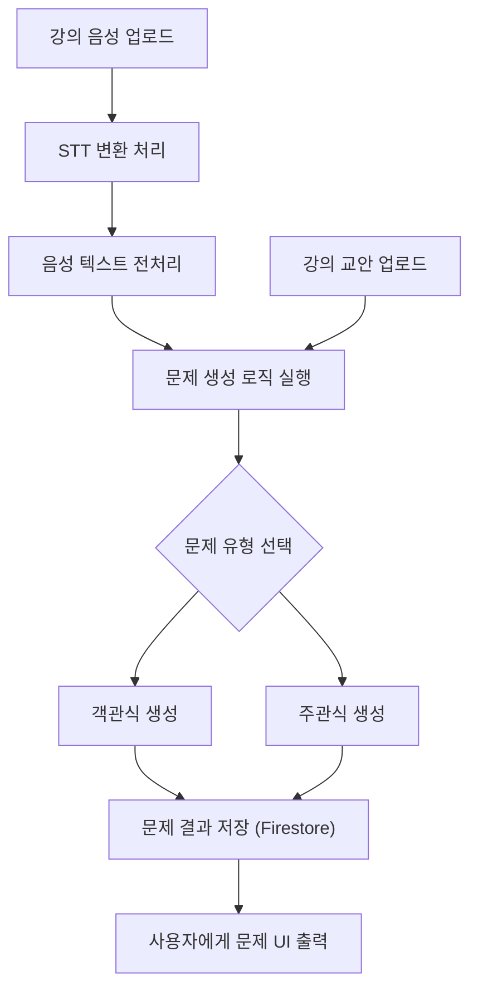

# 1. 개요
---
- **프로젝트명**: 세컨드 티처 (Second Teacher)
- **목표**: 강의 데이터 기반으로 시험 문제를 생성하여
	- **교수자**는 **간편하게 시험 문제를 생성**할 수 있고
	- **학생**은 **기출 기반 학습 자료**를 통해 **시험을 효율적으로 준비**할 수 있음.
- **수행기간**: 2025.04.25 ~ 2025.05.16 (3주)
- **사용 기술**: Python, Flask, Firebase Firestore, 외부 STT API
- **팀원 및 역할**:
  - **이수영(팀장)**: 프론트엔드 개발, 발표자료 작성
  - 임기홍: DB 및 API 연동, 문서 작성
  - 임상혁: 백엔드 개발, GitHub 관리

# 2. 주요 기능
---
- <font color="#de7802"><b>로컬 서버 실행 방법</b></font>
	1. **SDK 키 파일**과 **웹 API 키 파일**은 `app.py`가 있는 **가장 상위 디렉토리**에 위치시켜 주세요.
	2. 위 명령어를 터미널에서 순서대로 입력하세요.
  ```python title="실행 방법"
  pip install -r requirements.txt
  python app.py
  ```
	3. 실행 후 [http://127.0.0.1:5000/](http://127.0.0.1:5000/) 주소로 접속하면 됩니다.

| 구분        | 기능명           | 설명                                   |
| --------- | ------------- | ------------------------------------ |
| 🔊 음성 인식  | 강의 음성 입력      | 강의 음성 파일을 STT를 이용해 텍스트로 변환           |
| 🧠 데이터 처리 | 교안 + 음성 통합 학습 | 텍스트와 강의자료(교안)를 분석하여 학습               |
| 📝 문제 생성  | 예상문제 자동 생성    | 학습된 내용을 기반으로 템플릿 기반 객관식/주관식 문제 자동 생성 |
| 🖥️ 프론트엔드 | 문제 UI 제공      | 사용자 인터페이스에서 문제 확인 및 제출 가능            |
| ⚙️ 백엔드    | 문제 생성 로직 처리   | 텍스트 처리, 문제 템플릿 매칭, 생성 로직 구현          |
| 💾 DB 연동  | 학습 데이터 저장     | Firestore 기반으로 생성된 문제 및 학습 데이터 저장/조회 |

# 3. 기술 스택 및 상세 기능 (분류 통합)
---
## 🔧 **Backend**
---
- **사용 기술**: Python, Flask
- **주요 기능**:
    - 음성 파일 STT 변환 처리
        - `Whisper` API 사용
        - 예외 처리: 음질 저하 시 오류 메시지 출력
    - 문제 자동 생성
        - 방식: 템플릿 매칭 + 자연어 처리
        - 문제 형태: 객관식, 주관식
    - API 연동 및 백엔드 로직 처리 전반

### 👉 사용 가능한 Whisper 모델 비교표
---

| 모델 크기    | 정확도 🔤       | 속도 ⚡ (CPU 기준) | VRAM 요구량 (GPU 기준) | 용량 (모델 파일) | 특징 요약              |
| -------- | ------------ | ------------- | ----------------- | ---------- | ------------------ |
| `tiny`   | 낮음 (~64%)    | 매우 빠름         | 1~2GB 이상          | ~75MB      | 빠른 테스트용, 저사양 환경 적합 |
| `base`   | 보통 (~75%)    | 빠름            | 2~3GB 이상          | ~142MB     | 개발 단계에 추천          |
| `small`  | 중간 (~82%)    | 중간            | 4~5GB 이상          | ~466MB     | 정확도와 속도의 균형        |
| `medium` | 높음 (~88%)    | 느림            | 7~8GB 이상          | ~1.5GB     | 상당히 정확, 긴 오디오에 적합  |
| `large`  | 매우 높음 (~93%) | 매우 느림         | 10~12GB 이상        | ~2.9GB     | 가장 정확, 고성능 GPU 필요  |

## 🎨 **Frontend**
---
- **사용 기술**: HTML / CSS / JS 기반 (React 스타일 포함 가능)
- **주요 기능**:
    - 문제 표시 UI
    - 문제 제출 인터페이스
    - 반응형 UI 구현

## 🗂 **Database**
---
- **사용 기술**: Firebase Firestore
- **주요 기능**:
    - 문제 및 사용자 기록 저장
    - 스키마 예시:
        - `lectures/{lecture_id}/questions/{question_id}`
        - `users/{user_id}/records/`

# 4. 시스템 플로우차트
---


# 5. 개발 일정 및 진척도
---

| 항목       | 1주차 | 2주차 | 3주차 |
|------------|-------|-------|-------|
| 프론트엔드 | 10%   | 50%   | 100%  |
| 백엔드     | 30%   | 70%   | 100%  |
| DB 연동    | 20%   | 100%  | 100%  |
| API 연동   | 30%   | 50%   | 100%  |

# 6. 협업 전략
---
- 실시간 소통: **Discord**, **KakaoTalk**
- 코드 관리: **GitHub**
- 문서 작성: **Google Docs([정의서](https://docs.google.com/document/d/1aTtVSrTeK9DOHeq0TXSOjG3DcsUjHw4IXVyYV5uOfes/edit?usp=sharing), [분석서](https://docs.google.com/document/d/1P3BjDj4pYKQArDjXROtn6MUnWVdLQyxWOLknM7tSPFc/edit?usp=sharing))**, [**Obsidian**](https://obsidian.md/)
- 회의: 주 1회 디스코드 회의 + 주기적 코드 업데이트

# 7. 예상 리스크 및 대처
---

| 문제점 | 해결 방안 |
|--------|------------|
| STT 인식률 낮음 | 음성 품질 전처리 / STT API 교체 고려 |
| 강의자료 형식 다양성 | 최소 기준 가이드라인 마련 |

# 8. Todo 리스트
---
## 8.1. 기획 및 자료 준비
- [ ] 강의 음성 파일 수집 - 구현 중 (오디오 업로드 기능 있음)
- [x] 강의 교안 PDF 수집 - 구현됨 ([pdf_summarizer.py](https://github.com/Second-Teacher/Second-Teacher/blob/main/routes/pdf_summarizer.py))
- [ ] 문제 유형(객관식, 주관식 등) 정의 - 일부 구현 ([stt_generate_route.py](https://github.com/Second-Teacher/Second-Teacher/blob/main/routes/stt_generate_route.py))
- [x] 최소 입력 자료 형식 가이드라인 작성 - 구현됨 ([utils/file_utils.py](https://github.com/Second-Teacher/Second-Teacher/blob/main/utils/file_utils.py))

## 8.2. 백엔드 개발
- [x] 디렉토리 구조 설계 - 완료 ([Second Teacher Backend Guide > 📂 디렉토리 구성](https://github.com/Second-Teacher/Second-Teacher/blob/main/docs/Second%20Teacher%20Backend%20Guide.md#-%EB%94%94%EB%A0%89%ED%86%A0%EB%A6%AC-%EA%B5%AC%EC%84%B1))
- [x] Flask 프로젝트 초기화 - 완료 ([app.py](https://github.com/Second-Teacher/Second-Teacher/blob/main/app.py))
- [x] STT API 연동 및 전처리 로직 구현 - 완료 ([services/audio_service.py](https://github.com/Second-Teacher/Second-Teacher/blob/main/services/audio_service.py))
    - [x] 음성 → 텍스트 변환 처리 - 완료 ([services/audio_service.py](https://github.com/Second-Teacher/Second-Teacher/blob/main/services/audio_service.py))
    - [x] 음질 저하 예외 처리 및 오류 메시지 출력 - 완료 ([services/audio_service.py](https://github.com/Second-Teacher/Second-Teacher/blob/main/services/audio_service.py))
- [ ] 문제 생성 로직 설계 및 구현 - 일부 구현
    - [x] 교안 + 텍스트 데이터 통합 분석 - 완료 ([services/gemini_service.py](https://github.com/Second-Teacher/Second-Teacher/blob/main/services/gemini_service.py))
    - [ ] 템플릿 기반 객관식/주관식 문제 생성 - 일부 구현 ([services/question_generator.py](https://github.com/Second-Teacher/Second-Teacher/blob/main/services/question_generator.py))
- [x] API 요청 라우팅 구성 - 완료 ([routes/](https://github.com/Second-Teacher/Second-Teacher/tree/main/routes))
- [x] 로그 및 에러 기록 시스템 설계 - 완료 ([utils/file_utils.py](https://github.com/Second-Teacher/Second-Teacher/blob/main/utils/file_utils.py))

## 8.3. 프론트엔드 개발
- [x] UI 기본 구조 설계 - 완료 ([templates/](https://github.com/Second-Teacher/Second-Teacher/tree/main/templates))
    - [ ] 문제 출력 영역
    - [ ] 문제 입력/제출 폼
- [x] 반응형 UI 구현 (모바일/PC 대응) - 완료 ([static/main_styles.css](https://github.com/Second-Teacher/Second-Teacher/blob/main/static/main_styles.css))
- [ ] 문제 결과 출력 페이지 구현
- [x] 사용자 피드백 표시 (성공/실패, 에러 등) - 완료 ([templates/pdf_summarizer.html](https://github.com/Second-Teacher/Second-Teacher/blob/main/templates/pdf_summarizer.html), [templates/audio_uploader.html](https://github.com/Second-Teacher/Second-Teacher/blob/main/templates/audio_uploader.html))
- [x] 백엔드 API 연동 테스트 및 UI 응답 처리 - 완료 ([static/pdf_summarizer.js](https://github.com/Second-Teacher/Second-Teacher/blob/main/static/pdf_summarizer.js), [static/audio_uploader.js](https://github.com/Second-Teacher/Second-Teacher/blob/main/static/audio_uploader.js))

## 8.4. DB 및 API 연동
- [x] Firebase Firestore 연동 설정 - 완료 ([services/firebase_service.py](https://github.com/Second-Teacher/Second-Teacher/blob/main/services/firebase_service.py))
- [x] 데이터 스키마 설계 - 완료 ([routes/pdf_summarizer.py](https://github.com/Second-Teacher/Second-Teacher/blob/main/routes/pdf_summarizer.py), [routes/stt_generate_route.py](https://github.com/Second-Teacher/Second-Teacher/blob/main/routes/stt_generate_route.py))
    - [x] 강의 정보 - 완료 ([routes/summary_viewer.py](https://github.com/Second-Teacher/Second-Teacher/blob/main/routes/summary_viewer.py))
    - [x] 문제 및 정답 - 완료 ([services/question_generator.py](https://github.com/Second-Teacher/Second-Teacher/blob/main/services/question_generator.py))
    - [x] 사용자 풀이 기록 - 완료 ([routes/profile.py](https://github.com/Second-Teacher/Second-Teacher/blob/main/routes/profile.py))
- [x] STT API 연동 및 테스트 - 완료 ([services/audio_service.py](https://github.com/Second-Teacher/Second-Teacher/blob/main/services/audio_service.py))
- [x] 문제 및 학습 데이터 저장 기능 구현 - 완료 ([services/firebase_service.py](https://github.com/Second-Teacher/Second-Teacher/blob/main/services/firebase_service.py))
- [x] 사용자 기록 저장 및 조회 기능 구현 - 완료 ([routes/profile.py](https://github.com/Second-Teacher/Second-Teacher/blob/main/routes/profile.py))

## 8.5. 테스트 및 통합
- [ ] 음성 파일 → 문제 생성 전체 플로우 테스트 - 진행 중
- [ ] 오류 및 예외 상황 테스트 - 진행 중
- [ ] UI/UX 동작 검토 및 피드백 반영 - 진행 중
- [ ] 데이터 저장/조회 기능 테스트 - 진행 중

## 8.6. 문서 및 발표자료
- [x] GitHub README 작성 - 완료 ([README.md](https://github.com/Second-Teacher/Second-Teacher/blob/main/README.md))
- [ ] 발표자료 제작 - 미완료
- [ ] 프로젝트 회고 정리 - 미완료
