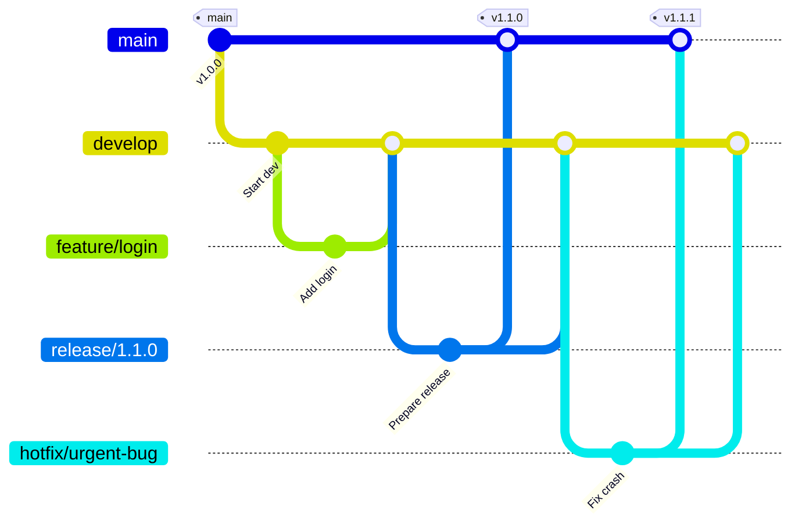
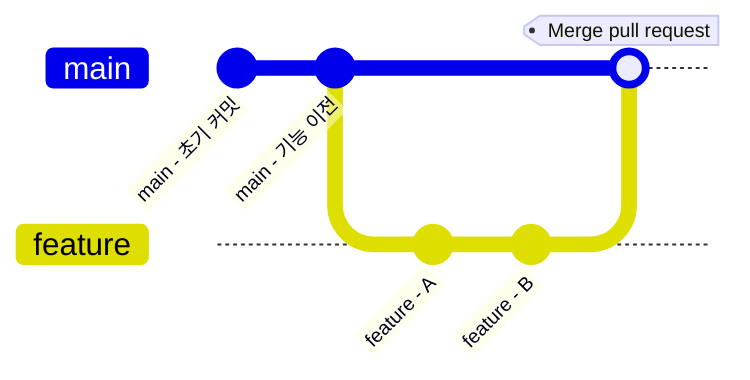
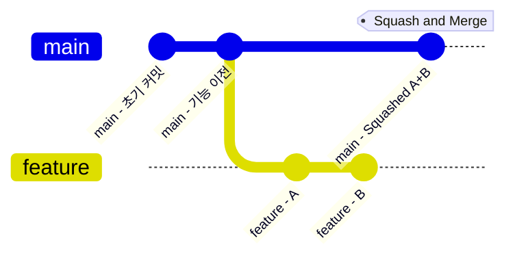
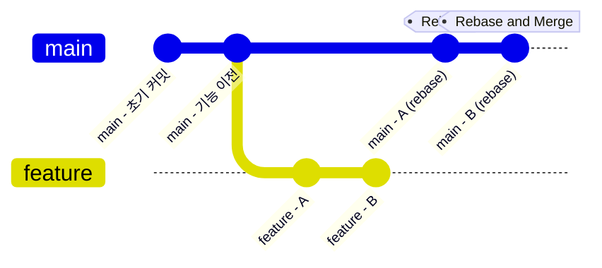

💡 참고: 본 프로젝트는 Branch 구조는 `Git Flow`를 따르되, Pull Request 및 merge 전략은 `GitHub Flow`를 기반으로 운영됩니다.

# 📌 목적
---
본 문서는 **세컨드 티처 프로젝트**의 효율적인 협업을 위해  
GitHub Flow 기반의 브랜치 전략을 정리한 가이드입니다.

# 1. 브랜치 전략 개요
---

| 브랜치 이름       | 역할                      |
| ------------ | ----------------------- |
| `main`       | 항상 **배포 가능한 안정된 코드** 유지 |
| `feat/*`     | 새로운 기능 개발용 브랜치          |
| `fix/*`      | 버그 수정용 브랜치              |
| `refactor/*` | 리팩토링 또는 구조 개선 브랜치       |
| `docs/*`     | 문서 작업 전용 브랜치            |
| `test/*`     | 테스트 코드 작업 브랜치           |



# 2. 브랜치 생성 규칙
---
```bash
# 기능 개발
git checkout -b feat/backend-STT

# 버그 수정
git checkout -b fix/login-error

# 문서 수정
git checkout -b docs/api-guide
```

# 3. 커밋 메시지 규칙
---
- Git Commit Convention 문서([Git Commit Message Convention.md](https://github.com/Second-Teacher/Second-Teacher/blob/main/docs/Git%20Commit%20Message%20Convention.md))를 따름
- 기본 구조:
  ```
  type(scope): subject

  body (선택)
  footer (이슈 번호 등, 선택)
  ```

- 예시:
  ```
  feat(backend): STT 변환 기능 구현
  fix(frontend): 문제 제출 시 UI 오류 수정
  docs(readme): 프로젝트 개요 및 실행 방법 추가
  ```

# 4. Pull Request(PR) 규칙
---
- **PR 제목**: 커밋과 동일하게 작성 (`type(scope): subject`)
- **PR 설명**에는 다음 포함:
    - 작업 내용 요약
    - 테스트 여부 (직접 확인했는지)
    - 관련된 이슈 번호 (있다면)

- 예시:
  ```
  ✨ feat(backend): STT 변환 기능 구현

  - Whisper API 연동
  - 오류 발생 시 예외처리 추가
  - 결과를 Firestore에 저장하는 기능 구현

  Resolves: #12
  ```

# 5. 병합(Merge) 전략
---
- PR 생성 후 최소 한 명의 리뷰를 받아야 `main`에 머지 가능
- 머지 방식은 `Merge pull request`나 `Squash and merge`를 사용

## 5.1. 🧩 Merge pull request 방식
---
### 설명
기본 머지 방식.  
`main`에 새로운 브랜치의 변경사항을 **하나의 병합 커밋(Merge Commit)**


### 장점
- **개발 흐름**을 보존.
- 누가 어떤 PR을 병합했는지 명확.

### 단점
- 커밋 로그가 **복잡해질 수 있음** (특히 작은 변경이 많은 경우).

## 5.2. 🧼 Squash and Merge 방식
---
### 설명
모든 커밋을 **하나로 뭉쳐서(squash)** 머지.  
PR에서 작업한 커밋이 여러 개여도, 머지하면 **한 개의 커밋**만 `main`에 들어감.


### 장점
- 히스토리 **깔끔**함.
- 커밋 메시지를 **PR 제목/설명으로 재작성 가능**.

### 단점
- **개별 커밋 정보**가 사라짐.
- 히스토리 추적이 어려울 수 있음 (누가 어느 파일을 왜 수정했는지까지는 보기 어려움).

## 5.3. 📐 Rebase and Merge 방식
---
### 설명
`main` 브랜치 위에 PR의 커밋들을 **재배치(rebase)**해서 머지.
즉, `feature-branch`의 커밋들을 `main` 위에 차례로 덧붙임.


### 장점
- **직선적 히스토리** 생성 → Git 로그 보기 편함.
- 각 커밋이 그대로 보존됨.

### 단점
- 이미 푸시된 커밋을 리베이스하면 **충돌이나 이슈 발생 가능성** 있음.
- 초보자에겐 약간 **위험**할 수 있음 (히스토리 변경이 되기 때문).

# 6. 브랜치 정리
---
- 머지된 브랜치는 **PR 머지 후 즉시 삭제**  
- 로컬에서는 다음 명령어로 삭제 가능:
  ```bash
  git branch -d feat/backend-STT
  ```

# 7. 협업 주기 및 도구
---
- 주 1회 디스코드 회의 (진척도 공유)
- GitHub Issue 및 PR 중심 협업
- 문서 작업은 Google Docs + Obsidian으로 분산 정리

# ✅ 참고 문서
---
- [[Git Commit Message Convention]]
- [README.md](README.md)
